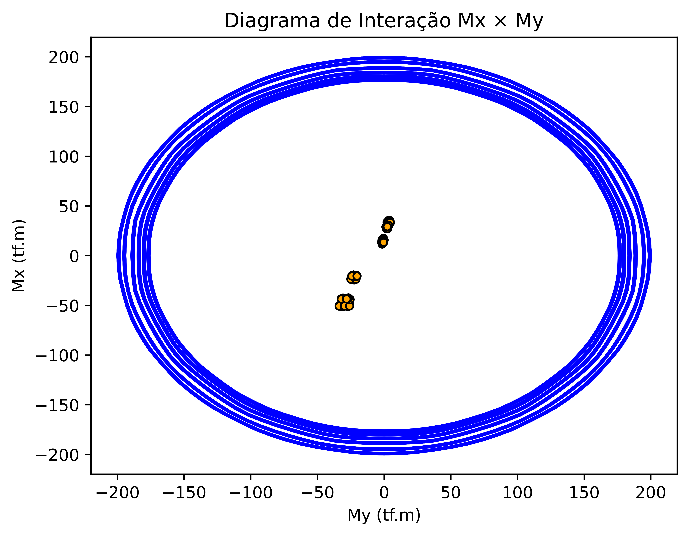

# PcalExpand — Parallel Batch Wrapper for PCAL

> Reverse-engineered wrapper around PCAL (a closed-source biaxial bending 
> moment calculator widely used in structural engineering), enabling 
> batch processing of hundreds of cases via parallelized Docker containers.

## The Problem

PCAL is the industry-standard tool for biaxial bending moment envelope 
calculation in RC columns. However:
- The source code was never released
- The original program accepts only ~10 manual inputs at a time
- Large projects (e.g. exported from SAP2000) generate hundreds of load cases

## The Solution

This project reverse-engineered the PCAL executable and wrapped it in Python, 
enabling:
- **Batch input** via `.xlsx` and `.yaml` (directly from SAP2000 exports)
- **Parallel execution** via multiple Docker containers orchestrated in Python
- **~100 cases/minute** throughput vs. ~10 manual inputs in the original tool

## Architecture
```
SAP2000 export (.xlsx)
        ↓
   config.yaml
        ↓
  orquestrador.py  ──→  [worker] [worker] [worker] 
        ↓
   write.py  ──→  results + envelope plot
```

## Input

| File | Description |
|------|-------------|
| `DAT_DIM.xlsx` | Section dimensions |
| `DAT_ESF.xlsx` | Load combinations from SAP2000 |
| `config.yaml`  | Run configuration |

## Output

- Biaxial bending moment envelope per column
- Excel with PCAL's outputs
- Example output:


